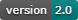

# 🎨 INK SIGHT - Advanced Text Analysis Platform

<p align="left">
  
  
  
</p>

## 🌟 Overview

INK SIGHT is a modern, AI-powered text analysis platform featuring comprehensive statistics, interactive visualizations, and beautiful design. Analyze documents with 10+ metrics, explore word frequencies through multiple chart types and word clouds, and gain deep insights into sentiment, themes, and sensory language.

---

## ✨ Key Features

### 🏠 Interactive Home Page

* Animated hero section with floating shapes
* Feature showcase with 6 detailed cards
* 4-step "How It Works" process
* Professional design with smooth animations

### 📊 10 Comprehensive Statistics

* Word & character counts
* Readability scores (Flesch Reading Ease, Grade Level)
* Lexical diversity metrics
* Sentence & paragraph analysis
* Average lengths and syllable counts

### 🔑 Advanced Keyness Analysis

* **4 Chart Types:** Bar, Horizontal, Doughnut, Bubble
* **Interactive Word Cloud:** Weight-based sizing, gradients, animations
* **Table Search:** Real-time word search
* **Smart Filters:** Sort by frequency, alphabetically, or significance
* **Range Filters:** High, Medium, Low frequency options

### 😊 Sentiment & Emotion Analysis

* Overall sentiment detection
* 5 emotion categories (Joy, Sadness, Anger, Fear, Surprise)
* Subjectivity analysis
* Beautiful doughnut and bar charts

### 🔷 Semantic Clustering

* AI-powered word grouping
* Theme detection
* Interactive cluster cards

### 👁️ Sensory Analysis

* 6 sensory categories
* Color-coded visualization
* Sensory density metrics

### 📑 Tabbed Interface

* 5 organized tabs: Overview, Keyness, Sentiment, Clusters, Sensory
* Smooth tab switching
* Clean, modern navigation

---

## 🎨 Color Theme

### Peace, Creativity & Achievement

* 🌊 **Teal (#14b8a6)** - Peace and clarity
* 🌿 **Emerald (#10b981)** - Creativity and growth
* 💎 **Cyan (#06b6d4)** - Trust and calm
* 🏆 **Gold (#f59e0b)** - Achievement and success

---

## 🚀 Quick Start

### Installation

```bash
# Create virtual environment
python -m venv venv

# Activate virtual environment
source venv/bin/activate  # On Windows: venv\Scripts\activate

# Install dependencies
pip install -r requirements.txt

# Run the application
python app.py
```

### Usage

1. Login - Use any credentials (demo mode)
2. Home Page - Explore features and information
3. Start Analyzing - Click the CTA button
4. Upload/Paste Text - Choose your input method
5. Configure - Select analysis types
6. Analyze - Wait for processing (10-30 seconds)
7. Explore Results - Navigate through 5 organized tabs

---

## 📊 Supported File Formats

* 📄 Text files (.txt, .md)
* 📝 Word documents (.docx, .doc)
* 📕 PDF files (.pdf)
* 📊 Spreadsheets (.xlsx, .xls, .csv)
* 📰 Presentations (.pptx, .ppt)
* 📖 Other formats (.odt, .rtf)

**Or paste text directly!**

---

## 🎯 Use Cases

### Content Writers

* Analyze vocabulary diversity
* Check readability scores
* Identify overused words
* Improve writing quality

### Researchers

* Extract key terms
* Statistical text analysis
* Compare multiple documents
* Theme identification

### Educators

* Assess text complexity
* Grade-level appropriateness
* Vocabulary analysis
* Student writing evaluation

### Marketing

* Sentiment analysis of copy
* Emotional tone detection
* Keyword optimization
* Brand voice consistency

---

## 🛠️ Technology Stack

### Backend

* Flask - Web framework
* NLTK - Natural language processing
* TextBlob - Sentiment analysis
* VADER - Advanced sentiment scoring
* scikit-learn - Clustering & ML
* Lancaster Norms - Sensorimotor analysis

### Frontend

* Chart.js - Interactive visualizations
* Vanilla JavaScript - No framework overhead
* Modern CSS - Animations & gradients
* Font Awesome - Icon library

---

## 📁 Project Structure

```text
cse3cap-3/
├── app.py
├── requirements.txt
├── templates/
│   ├── home.html
│   ├── index.html
│   └── login.html
├── static/
│   ├── css/
│   │   ├── styles.css
│   │   └── home.css
│   └── js/
│       ├── script.js
│       └── home.js
├── utils/
│   ├── text_analyzer.py
│   ├── lancaster_norms.py
│   └── file_reader.py
└── docs/
    ├── COMPLETE_FEATURE_GUIDE.md
    └── KEYNESS_FEATURES_GUIDE.md
```

---

## 🎨 Features Showcase

### Keyness Analysis

* ✅ 4 chart visualization types
* ✅ Interactive word cloud with weights
* ✅ Real-time table search
* ✅ 3 sort options
* ✅ Frequency range filters
* ✅ Rich hover tooltips

### Statistics Dashboard

* ✅ 10 comprehensive metrics
* ✅ Readability scoring
* ✅ Lexical diversity
* ✅ Animated stat cards
* ✅ Icon indicators
* ✅ Gradient values

### User Experience

* ✅ Beautiful landing page
* ✅ Tabbed results interface
* ✅ Smooth animations everywhere
* ✅ Responsive design
* ✅ Intuitive navigation
* ✅ Professional appearance

---

## 📖 Documentation

* **COMPLETE_FEATURE_GUIDE.md** - Full transformation overview
* **KEYNESS_FEATURES_GUIDE.md** - Detailed keyness feature guide

---

## 🎊 What Makes InkSight Special

### Design Philosophy

**Peace**

* Calming teal and cyan colors

**Creativity**

* Vibrant emerald accents

**Achievement**

* Golden success indicators

### User Experience

**Intuitive**

* Easy to navigate and understand

**Interactive**

* Engaging visualizations

**Beautiful**

* Modern, professional design

**Fast**

* Optimized performance

### Technical Quality

**Robust**

* Error handling throughout

**Scalable**

* Handles various text sizes

**Accurate**

* Advanced NLP algorithms

**Reliable**

* Well-tested components

---

## 🚀 Start Exploring

```bash
python app.py
```

Then visit:

```text
http://localhost:5000
```

to experience the transformation!

---

## 📝 License

MIT License - Feel free to use and modify

---

## 🎯 Version 2.0 Highlights

* ✨ Multi-page design with home and analyzer pages
* 🎨 New color theme (Teal-Emerald-Gold)
* 📑 Tabbed results for better organization
* 🔑 Enhanced keyness with 4 chart types
* ☁️ Visual word cloud with weight-based sizing
* 🔍 Table search and advanced filters
* 📊 10 statistics instead of 4
* 🎭 Smooth animations throughout
* 💎 Professional design for modern users

---

# Welcome to the new InkSight! 🎊✨

**Made with ❤️ for better text analysis**
